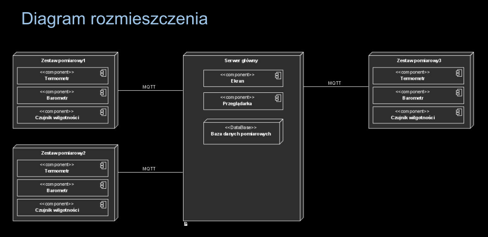
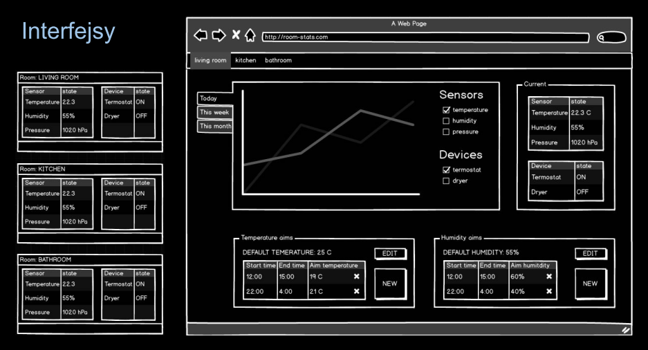

# Czujniki inteligentnego domu

## Temat projektu
Tematem  projektu  jest  obsługa  inteligentnego  domu;  czujników  temperatury, 
ciśnienia  i  wilgotności.  System  zbiera  dane  z  pokojów  i  podejmuje  decyzje 
dotyczące  zmian  w  urządzeniach  domowych  typu  utrzymywanie  odpowiedniej 
temperatury czy wilgotności

## Elementy projektu
### Rodzaje czujników:
- Temperatura
- Ciśnienie
- Wilgotność

### Urządzenia IOT:
- Wyświetlacz z obecnymi wartościami
- Termostat
- Osuszacz

## Wymagania funkcjonalne
- Pokazywanie wykresów historii wartości na czujnikach temperatury, wilgotności oraz ciśnienia
- Informacje o użyciu osuszacza
- Informacje o użyciu termostatu
- Możliwość zmodyfikowania preferowanych wartości temperatury i wilgotności
- Możliwość ustawienia okresów o określonych parametrach (typu zmniejszenie temperatury w godzinach, w których nikogo nie ma w domu)

## Wymagania niefunkcjonalne
- Języki i technologie programowania użyte do implementacji: Python, technologie programowania webowego
- Komunikacja między urządzeniami: MQTT
- Czujniki, termostaty: pod systemem operacyjnym Raspberry Pi OS
- Serwer jako główna centrala: z systemem operacyjnym Linux (np. Ubuntu)
- Sieć VPN udostępniona przez Hamachi
- Baza danych Cassandra działająca na Dockerze

